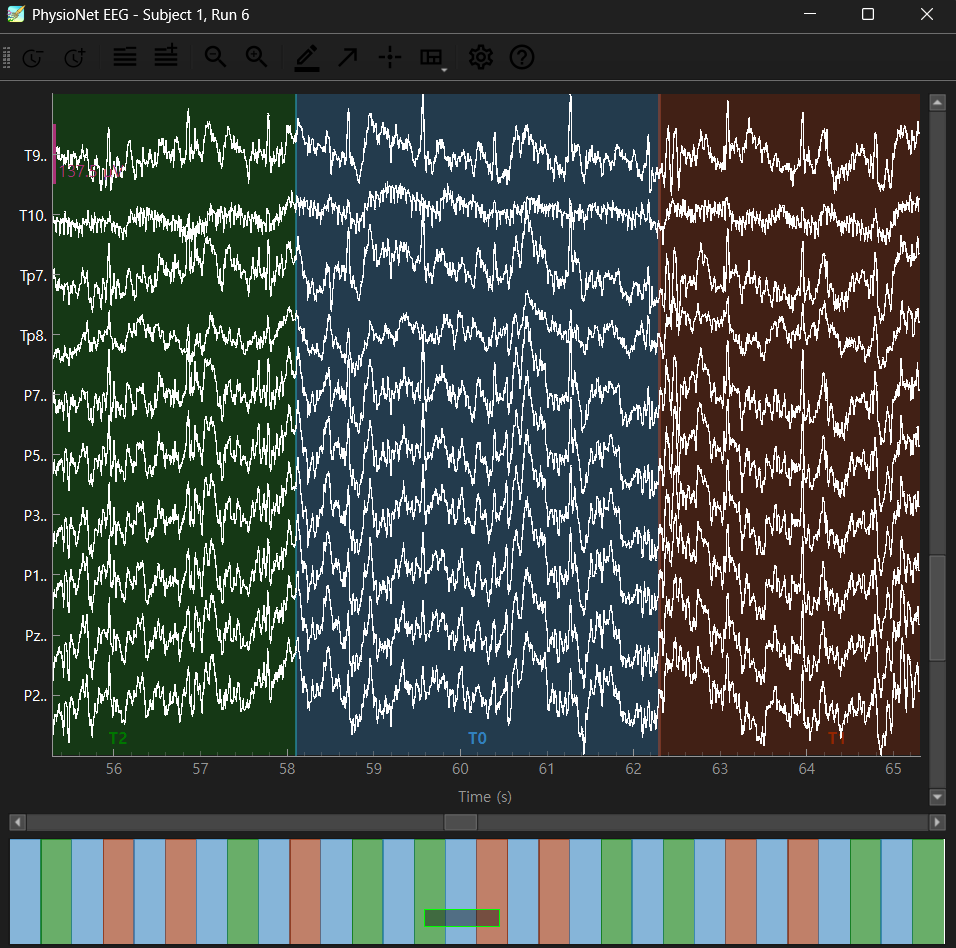

# Day 2 - Plotting real EEG Data

> **Date:** 2026-08-10 
> **Study Time:** 2 h  
> **Project:** EEG & BCI Research Project  
> **Week:** Week 1 
> **Progress:** 7%

---

## Today's Goals

- [x] Goal 1: Import 'EEG Motor Movement/Imagery Dataset'
- [x] Goal 2: See the number of channels, sampling frequency, duration seconds 
- [x] Goal 3: Plot EEG waves

---

## Key Concepts

### 1. EEG Motor Movement/Imagery Dataset

### 2. Create configs file

### Connection to Previous Knowledge

- In audio, there were just 2 channels: left and right
- There are lots of channels in brain! Each channel indicates each electrode. There is 64 electrodes on one experiment.

---

## Code

### Key Code

```python
def download_eegbci_run() -> Path:
    file_paths = eegbci.load_data(
        subjects = SUBJECT_ID,
        runs = [RUN_ID],
        path = DATA_DIR,
        update_path = False,
    )

    return Path(file_paths[0])```

### Code Explanation

- **Purpose:**  Load EEGBCI

---

## Results

### Result 1 - PhysioNet EEG



**Observation**
- We pick 1 participant, with 1 record (6th run).
- *T0* indicates *rest time*
- *T1* indicates *movement of both hands*
- *T2* indicates *movement of feet*

---


## References

- [MNE-Python Documentation](https://mne.tools/)

---

## Next Step

- [ ] EEG Filtering
- [ ] Seperate signal to noise
- [ ] 

---


**Today's Commit Message**

```text
docs: complete Day 2 research note
```