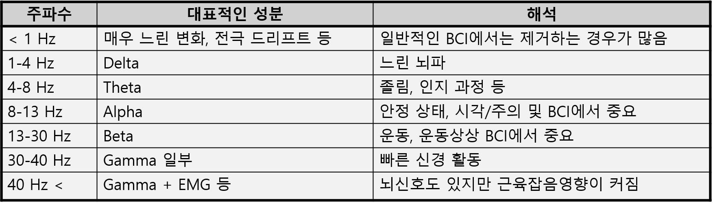
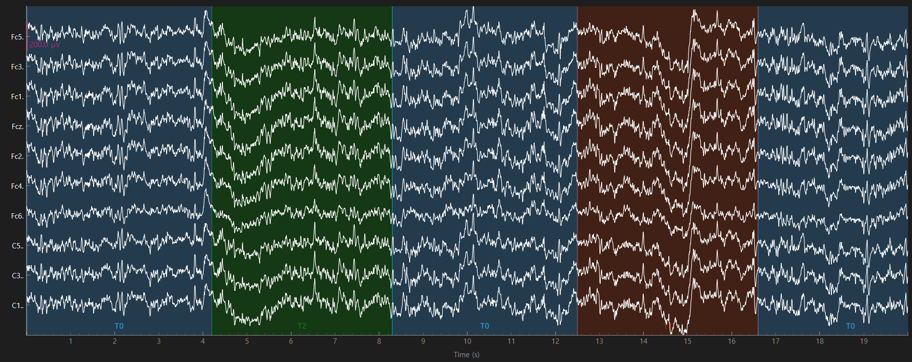
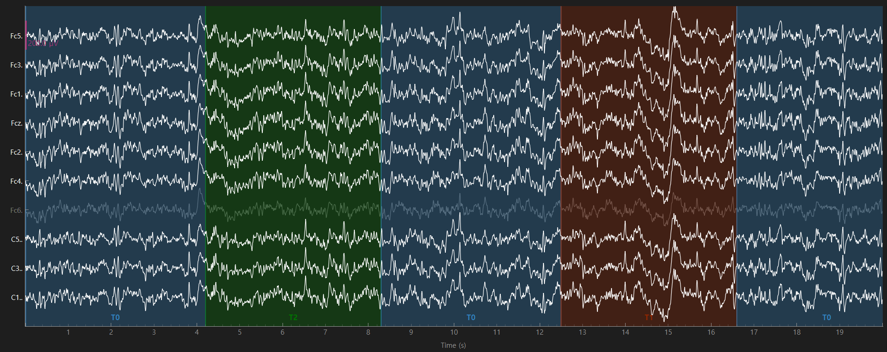

# Day 3 - Filtering (BPF)

> **Date:** 2026-08-13  
> **Study Time:** 1 h  
> **Project:** EEG & BCI Research Project  
> **Week:** Week 1
> **Progress:** 10%

---

## Today's Goals

- [x] Goal 1: Copy EEG data
- [x] Goal 2: Plot EEG data
- [x] Goal 3: Compare Original vs Filtered EEG

---

## Key Concepts: Frequency Components

**Explanation**



---

## Code

### Key Code

```python
from eegbci_io import load_eegbci_raw

raw_original = load_eegbci_raw(preload=True)
raw_filtered = raw_original.copy() # copied EEG raw data

# Band Pass Filter
raw_filtered.filter(l_freq=1.0, h_freq=40.0) # filter() method: MNE의 Raw 객체에 주파수 필터를 적용
```

### Code Explanation

- **Purpose:**  BPF for copied EEG data

Extracting EDF parameters from D:\EEG\Datasets\raw\MNE-eegbci-data\files\eegmmidb\1.0.0\S001\S001R06.edf...
Setting channel info structure...
Creating raw.info structure...
Reading 0 ... 19999  =      0.000 ...   124.994 secs...
Filtering raw data in 1 contiguous segment
Setting up band-pass filter from 1 - 40 Hz

FIR filter parameters
---------------------
Designing a one-pass, zero-phase, non-causal bandpass filter:
- Windowed time-domain design (firwin) method
- Hamming window with 0.0194 passband ripple and 53 dB stopband attenuation
- Lower passband edge: 1.00
- Lower transition bandwidth: 1.00 Hz (-6 dB cutoff frequency: 0.50 Hz)
- Upper passband edge: 40.00 Hz
- Upper transition bandwidth: 10.00 Hz (-6 dB cutoff frequency: 45.00 Hz)
- Filter length: 529 samples (3.306 s)

---

## Results

### Original EEG vs Filtered EEG




**Observation**

- Slow baseline shifts were slightly reduced after filtering below 1 Hz.
- Rapid, fine fluctuations became smoother after reducing components above 40 Hz.
- Major waveform changes remained at similar time points, suggesting that key EEG patterns were preserved.

---

## Next Step

[ ] Calculate and visualize the power spectral density (PSD) of the filtered EEG.
[ ] Identify delta, theta, alpha, and beta frequency bands.
[ ] Compare spectral characteristics across T0, T1, and T2 conditions.

---

## Summary

- Frequencies below 1 Hz were reduced to suppress slow baseline drift
- Frequencies above 40 Hz were reduced to attenuate high frequency noise, including possible muscle-related activity
- The main EEG waveform patterns were preserved after applying the 1-40 band-pass filter

---


**Today's Commit Message**

```text
docs: complete Day 3 research note
```