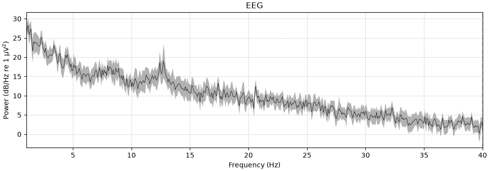
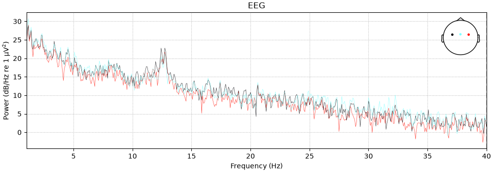
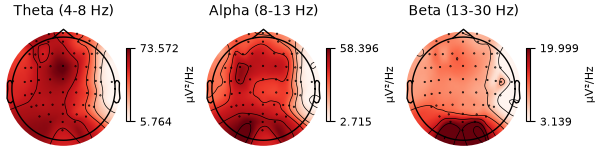

# Day 4 — Analysis of EEG in the frequency domain

> **Date:** 2026-08-13
> **Study Time:** 2 h  
> **Project:** EEG & BCI Research Project  
> **Week:** Week 1  
> **Progress:** 11%

---

## Today's Goals

- [x] Goal 1 Understand PSD(Power Spectral Density) Concept
- [x] Goal 2 Calculate PSD of Filtered EEG
- [x] Goal 3 Observe main peak in PSD graph
- [x] Goal 4 Identify & Mark **theta, alpha, beta** waves on montage

---

## Key Concepts

### 1. PSD

**One-sentence definition**

Power Spectral Density: 주파수별 신호 에너지의 분포

PSD describes how signal power is distributed across frequencies

**Why it matters for EEG/BCI research**

In the PSD graph, we can find which frequency area is the strongest or weakest

---

### 2. Montage

**One-sentence definition**

EEG 전극의 두피 위 위치 정보 지도

**Explanation**

- C3: 좌측 감각운동피질 부근의 두피 전극
- Cz: 정중앙 감각운동피질 부근 전극
- C4: 우측 감각운동피질 부근의 두피 전극

---

## Code

### Key Code 1

```python
spectrum = raw.compute_psd(fmin = 1.0, fmax = 40.0)
```

#### Code Explanation

- **Purpose:**  This code computes PSD
- **Input:**  주파수 하한값, 상한값을 부여한다
- **Output:**  1~40 Hz의 PSD 값을 보인다

### Key Code 2

```python
bands = {
    "Theta (4-8 Hz)": (4,8),
    "Alpha (8-13 Hz)": (8,13),
    "Beta (13-30 Hz)": (13,30),
}

spectrum.plot_topomap(bands = bands, ch_type="eeg")
```

#### Code Explanation

- **Purpose:**  Plot topomap, which shows the distribution of certain frequency band on the montage
- **Input:**  Settle frequency bands as Theta, Alpha, Beta

### Key Code 3

```python
spectrum.plot(
    picks = ["C3", "Cz", "C4"],
    average = False,
    spatial_colors = True,
)
```

#### Code Explanation

- **Purpose:**  Plot PSD graph only of C3, Cz, C4

---

## Results

### Result 1 — Overall PSD graph



**Observation**

- This is the PSD Graph.

**Interpretation**

We can find the peak: about **12.5 Hz**.
we can observe that 12.5 Hz is stronger than its nearby.

### Result 2 — PSD graph of Central Channels



**Observation**

- This is the PSD Graph of C3, Cz, C4.

### Result 3 — Spatial Distribution of PSD power of Theta, Alpha, Beta bands



**Observation**

- This is the PSD energy distribution of 3 frequency bands: **Theta, Alpha, Beta**

> Theta: 4-8 Hz
> Alpha: 8-13 Hz
> Beta: 13-30 Hz

**Interpretation**

- **Black dot**: Electrode locations
- **Color**: PSD power of the region Interpolated PSD power across scalp locations
- **Contour lines**: Lines of equal interpolated PSD power

---

## Next Step

- [ ] Learn common EEG artifacts, including eye blinks, muscle activity, and electrode noise
- [ ] Inspect raw EEG signals for possible artifact-contaminated segments
- [ ] Annotate and document artifact observation using MNE

---

## Summary

> Summarize today's learning in three to five sentences.

1. I computed and visualized PSD of filtered EEG data.
2. I compared the PSD of the central channels C3, Cz, and C4.
3. I used topomaps to visualize the spatial distribution of PSD power across frequency bands

---

**Today's Commit Message**

```text
docs: complete Day 4 research note
```