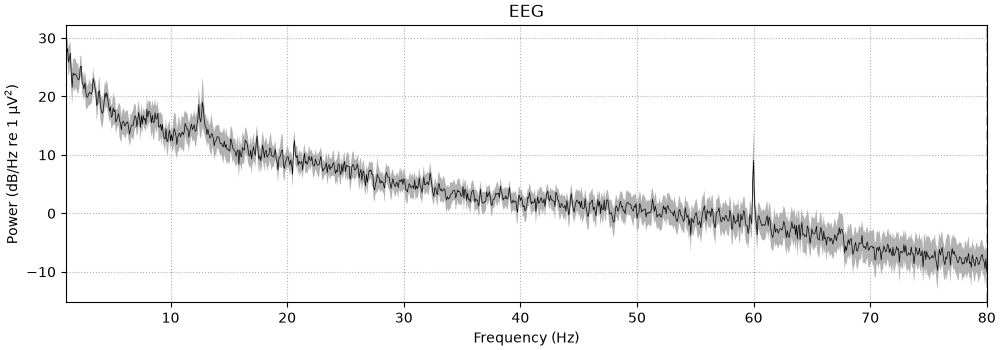
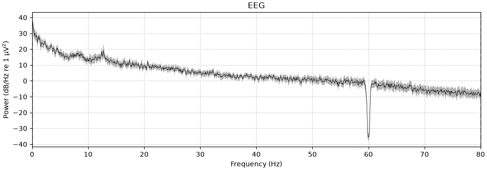
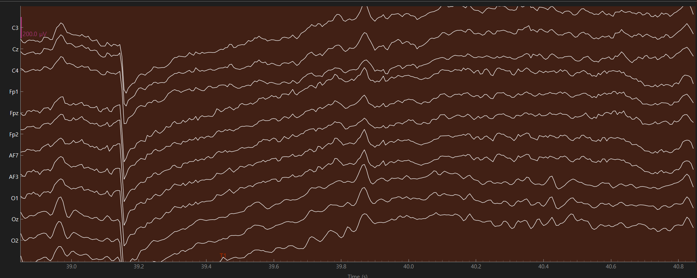
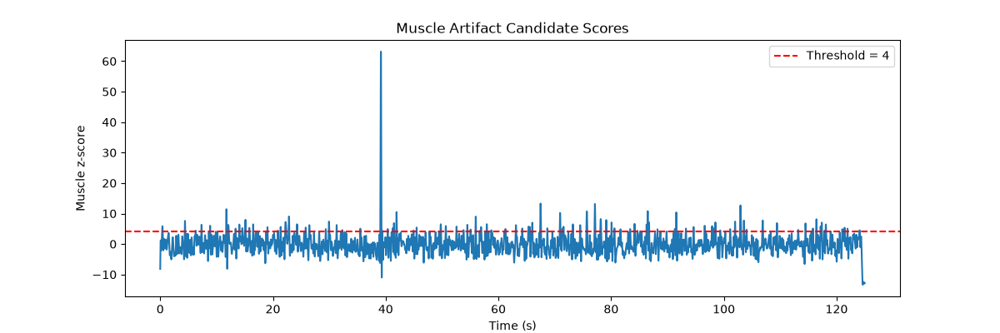
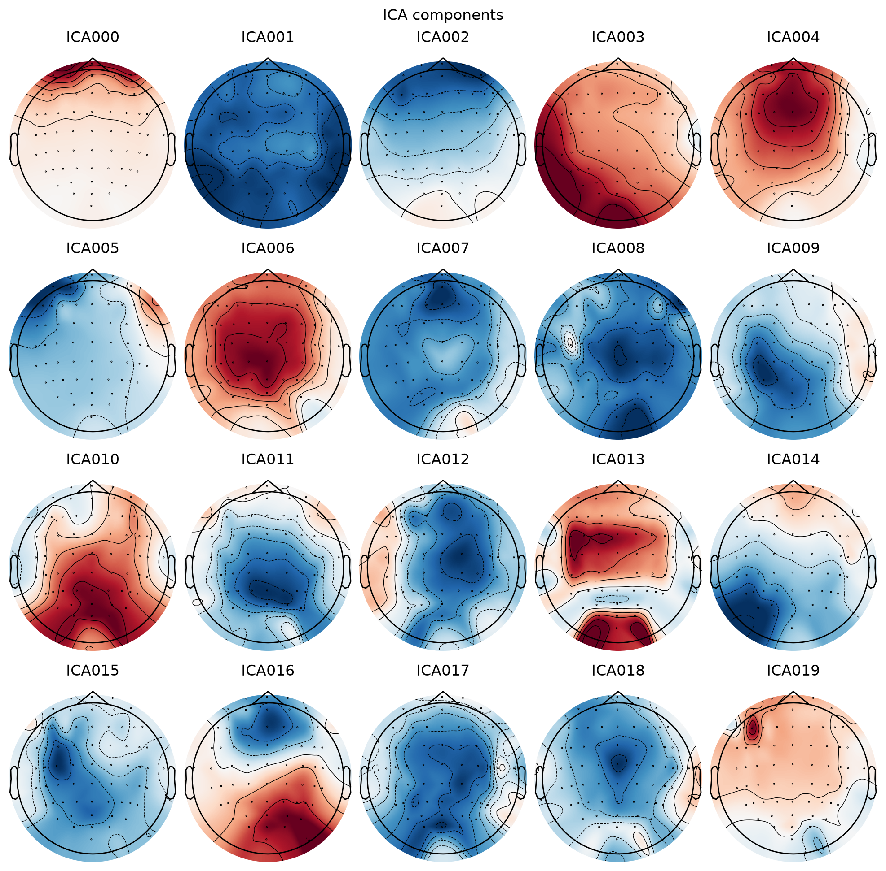
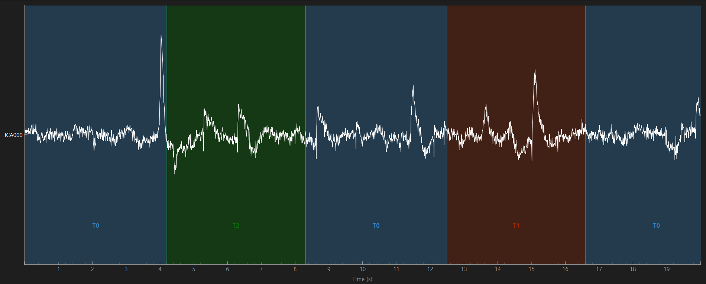
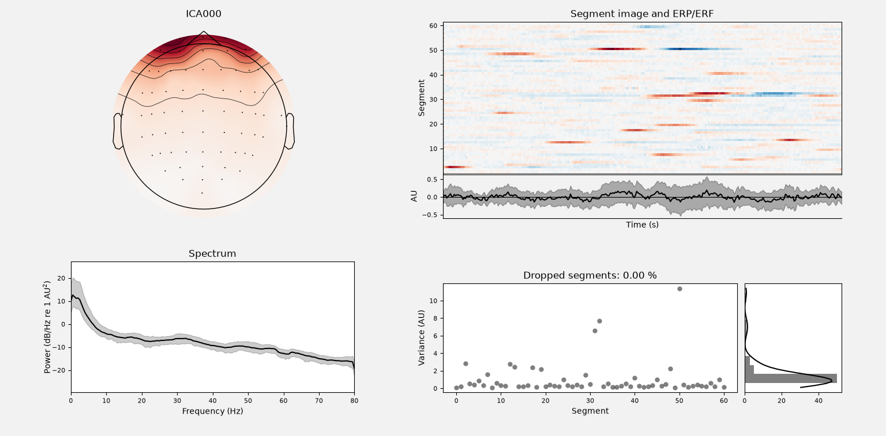

# Day 5 — Artifact inspection

> **Date:** 2026-08-22
> **Study Time:** 5 h  
> **Project:** EEG & BCI Research Project  
> **Week:** Week 1 
> **Progress:** 13%

---

## Today's Goals

- [x] Goal 1: Identify artifact types in EEG waves
- [x] Goal 2: Identify candidates for each artifact type

---

## Code

### Key Code 1: Notch Filter

```python
raw_notched.notch_filter(
    freqs=[60.0],
)
```

- **Purpose:**  Apply a Notch filter at 60.0 Hz
- **Why it is used:**  Attenuate power-line noise

### Key Code 2: Find sample changes over 150 µV

```python
peak_annotations, bad_channels =  mne.preprocessing.annotate_amplitude(
    raw_notched,
    peak = 150e-6,
    picks="eeg",
)
```

- **Purpose:** Identify peak and transient candidates

### Key Code 3: Inspect Muscle artifacts

```python
muscle_annotations, muscle_scores = mne.preprocessing.annotate_muscle_zscore(
    raw_notched,
    threshold = 4,
    ch_type = "eeg",
    filter_freq = (30,70)
)
```

- **Purpose:**  Identify muscle artifact candidates


### Key Code 4: Inspect Eye movement artifacts

```python
ica = mne.preprocessing.ICA(
    method="fastica",
    random_state = 97,
    max_iter = "auto",
)

ica.fit(
    raw_ica,
    picks="eeg",
    reject_by_annotation = True,
)
```

- **Purpose:**  Create and fit an ICA model
- **Why it is used:**  Separate mixed signals from 64 EEG channels into 64 independent components


```python
component_figures = ica.plot_components(
    picks = range(20),
    show=False,
)
```

- **Purpose:**  Plot topographies of ICA components 0-19

```python
ica.plot_sources( # time-domain relative waves
    raw_ica,
    picks = [0],
    start = 0,
    stop = 20,
    block = True,
)
```

- **Purpose:**  Plot the time-domain waveform of ICA000 to inspect whether it is an eye-blink artifact candidate.

```python
ica.plot_properties( # property w/ PSD
    raw_ica,
    picks = [0],
    dB=True,
    reject_by_annotation = True,
)
```

- **Purpose:**  Plot ICA000 properties, including its PSD, to further evaluate it as an eye-blink artifact candidate.

---

## Results

| Artifact type | Detection method | Result | Interpretation |
|---|---|---|---|
| Power-line noise | PSD | Sharp peak at 60 Hz | Reduced using a 60 Hz notch filter |
| Peak / transient candidate | 150 µV sample-change criterion | 18 `BAD_peak` candidates | A global transient candidate was observed near 39.14 s |
| Muscle artifact candidate | 30–70 Hz muscle z-score, threshold = 4 | 108 `BAD_muscle` candidates | Screening result; not automatically removed |
| Eye-related artifact candidate | ICA + Fpz-proxy screening | ICA000, ICA002, ICA004 | ICA000 was the strongest eye-blink candidate |


### Result 1 — Power Line Noise



**Observation**

- There's a peak at 60 Hz in this raw PSD graph
- 이는 전원선 간섭 잡음 후보이다



**Observation**

- Notch Filter reduces the peak
- This is the PSD graph after applying Notch Filter

---

### Result 2 — Peak / transient

**Explanation**

- Find instantaneous amplitude changes exceeding 150 

**Observation**


- There were 18 BAD_peak candidates
- 39.14s was marked as a global transient candidate
- Abrupt changes appeared almost simultaneously across multiple channels
- The cause may be electrode contact, a common-reference effect, the recording system, or another recording-related event; it cannot be determined from the current data alone

---

### Result 3 - Muscle Artifact

**Explanation**

- Muscle activity can introduce broadband high-frequency components into EEG recordings, especially from the jaw, neck, and temporal muscles.



**Observation**

- By evaluating **30-70 Hz** muscle z-score, we found 108 BAD_muscle candidates
- A z-score threshold of 4, the MNE default, was used as an exploratory criterion for muscle artifact detection

---

### Result 4 - Eye-related Artifact



**Explanation**

- The figure shows the topographies of ICA components 0-19.
- ICA000 was selected for further inspection as the strongest eye-blink artifact candidate.
- ICA002 and ICA004 were retained as Fpz-proxy screening candidates and were not classified as eye-blink components.

**Observation**
| Component | Observation | Interpretation |
|---|---|---|
| ICA000 | Broad and symmetric frontal distribution | Strongest **Eye-blink** candidate |
| ICA002 | Frontal-related spatial pattern | Fpz-proxy screening candidate |
| ICA004 | Relatively strong fronto-central distribution | Fpz-proxy screening candidate |
| ICA010 | Anterior-posterior pattern without clear lateral polarity | Not confirmed as horizontal eye movement |
| ICA016 | Both frontal and posterior weights were strong | Not a typical blink pattern |
| Others | Some frontal weights, but complex or non-frontal dominant patterns | Not classified as blink candidates |



**Explanation**
- Large-amplitude pulses appeared repeatedly.
- The pulses showed similar and relatively slow temporal changes




**Explanation**

- ICA000 showed relatively strong low-frequency power, mainly around 1-10 Hz.
- Together with its frontal topography and repeated pulse-like waveform, this supported ICA000 as the strongest eye-blink artifact candidate.

---

## Insights / Ideas

- A 60 Hz notch filter(band-stop filter) attenuates narrowband power-line noise.
- Muscle activity can introduce broadband high-frequency components (30-70 Hz) into EEG recordings.
- ICA (Independent Component Analysis) separates mixed EEG channel signals into statistically independent components for artifact inspection.
- Automatic artifact detection provides candidates; visual and physiological validation are still required.

---

## Next Step

- [ ] Review the T0, T1, and T2 annotations in the EEG recording. 
- [ ] Create epochs for each experimental condition.
- [ ] Inspect and compare the epoch structure before condition-based PSD analysis.

---

## Summary

1. Artifact and noise candidates in EEG 
> Power line noise, Muscle artifacts, Eye-related artifacts
> A global transient candidate was observed near 39.14s
2. Notch Filter: Sharp band-stop filter at specific frequency
> A notch filter attenuates narrowband power-line noise at a specific frequency
3. Muscle Artifacts are detected in 30-70 Hz
4. ICA separates mixed EEG signals into statistically independent components for artifact inspection

---

**Today's Commit Message**

```text
docs: complete Day 5 research note
```