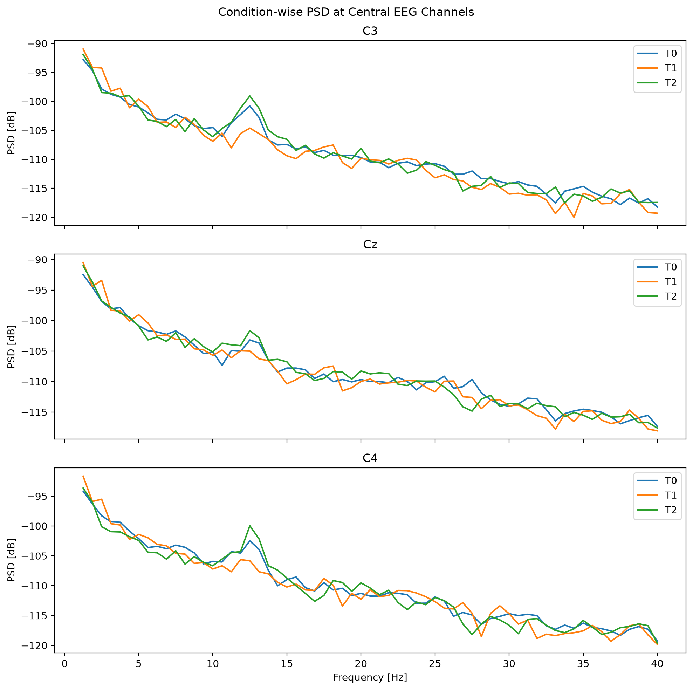
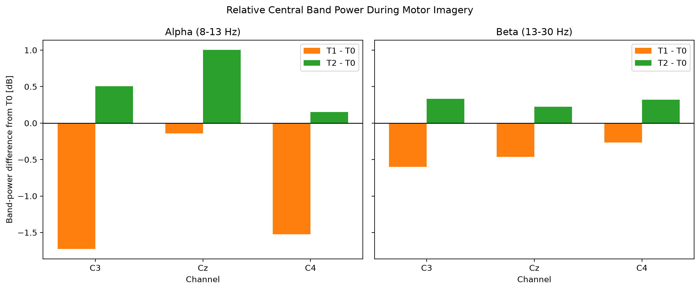

# Day 7 — Condition-wise EEG PSD Comparison

> **Date:** 2026-08-26  
> **Study Time:** 2 h  
> **Project:** EEG & BCI Research Project  
> **Week:** Week 1 
> **Progress:** 16%

---

## Today's Goals

- [x] Goal 1: Load the processed EEG epochs from the FIF file
- [x] Goal 2: Compute condition-wise PSDs for T0, T1, and T2
- [x] Goal 3: Compare Alpha and Beta band power at C3, Cz, C4

---
## Dataset

- **Dataset:** PhysioNet EEG Motor Movement/Imagery Dataset
- **Participant:** Subject 1
- **Run:** Run 6
- **Task:** Motor Imagery of opening and closing both fists (T1) or both feet (T2)
- **Reference Condition:** Rest (T0)

## Key Concepts

### 1. FIF and 'mne.read_epochs()'

**One-sentence definition**

> FIF (Functional Imaging File Format) is MNE's file format for storing EEG data together with analysis metadata

**Explanation**

- A FIF file stores EEG epochs together with
> Channel information, Sampling frequency, Events, and Time information

- 'mne.read_epochs(..., preload = True)' loads the saved Epochs object and its EEG values into memory


### 2. Welch PSD

**One-sentence definition**

> Welch's method estimates PSD by averaging spectral estimates from multiple signal segments

**Explanation**

- Welch's method estimates PSD by dividing a signal into segments and averaging their spectral estimates
- It was used to obtain a more stable PSD estimate for each condition


### 3. FFT size

**One-sentence definition**

- 'n_fft = 256' uses 256 samples per PSD window

**Explanation**

- At 160 Hz, this corresponds to a 1.6-second window and a frequency spacing of 0.625 Hz
- This analysis retained 63 frequency bins from 1.25 Hz to 40.0 Hz

---

### 4. Python 'for loop' patterns

**Explanation**

- 'enumerate(iterable)' returns both the index and each item from an iterable
- 'dictionary.items()' returns each key and its corresponding value from a dictionary
- 'zip(iterable1, iterable2)' returns paired items from 2 iterables in matching order

---

## Code

### Key Code 1 -- Compute PSD

```python
for condition in epochs.event_id:
    spectra[condition] = epochs[condition].compute_psd(
        method = "welch",
        fmin = 1.0,
        fmax = 40.0,
        picks = central_channels,
        n_fft = 256,
    )
```

### Code Explanation

- **Purpose:** Compute PSD in welch method

---

### Key Code 2 -- Compute Band Power

```python
frequency_mask = (
    (frequencies >= fmin) & (frequencies <= fmax)
)

band_power = np.trapezoid(
    mean_psd[condition][:, frequency_mask],
    frequencies[frequency_mask],
    axis = 1,
)
```

### Code Explanation

- **Purpose:**  Compute Alpha and Beta band power by integrating PSD values over each frequency band
- **Grammer:** trapezoid: 사다리꼴 적분법
- **mean_psd[condition][:, frequency_mask]:** 해당하는 condition(alpha/beta) bin들의 PSD 값
- **frequencies[frequency_mask]:** 해당 bin들의 주파수값
- **axis = 1:** 각 채널에서 주파수 방향으로 적분


---
### Key Code 3 -- Plot Relative Band Power

```python
for axis, band_name in zip(axes, bands):
    t0_power = band_power_db["T0"][band_name]

    t1_change = band_power_db["T1"][band_name] - t0_power
    t2_change = band_power_db["T2"][band_name] - t0_power

    axis.bar(
        x - bar_width / 2,
        t1_change,
        width = bar_width,
        label = "T1 - T0",
        color = "tab:orange",
    )
```

### Code Explanation

- **Purpose:**  Plot bar graph to visualize the difference between T1-T0, and T2-T0

---

## Results

### Result 1 — Condition-wise PSD



**Observation**

- The PSD curves show an overall 1/f-like decrease and a local Alpha-range peak near 12-13 Hz

---

### Result 2 — Relative Band Power



**Observation**

- T1 band power was lower than T0 in all displayed channel-band pairs
- T2 band power was higher than T0 in all displayed channel-band pairs
- The largest difference was observed for T1 Alpha power at C3: approximately -1.72 dB 

**Interpretation**

> A -1.72 dB difference corresponds to approximately 33% lower linear power than T0

> These are condition-wise observations from one participant and should not be interpreted as confirmed effects of Motor Imagery

## Next Step

- [ ] Review and summarize the complete Week 1 EEG preprocessing workflow.

---

## Summary

1. Computed Welch PSDs for T0, T1, and T2 epochs 
2. Compared Alpha and Beta band power at C3, Cz, C4
3. Visualized relative differences from the T0 reference condition

---

**Today's Commit Message**

```text
docs: complete Day 7 research note
```