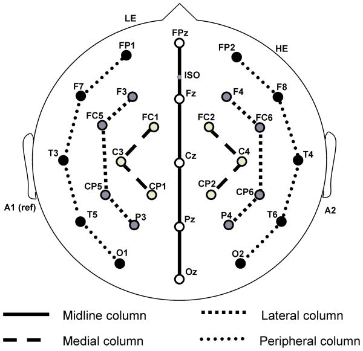

# Week 1 -- EEG Fundamentals and Preprocessing

> **Study Period:** 2026-08-08 ~ 2026-08-31


> **Project:** EEG & BCI Research Project


> **Overall Project Progress:** 16%


---

## Week 1 Goal

> Build a practical foundation for handling EEG data with MNE-Python, from loading continuous recordings to condition-wise spectral analysis

---

## Weekly Overview

| Day | Topic | Key Outcome |
|---|---|---|
| Day 1 | MNE-Python Basics | Created `Info` and `RawArray` objects for synthetic EEG data |
| Day 2 | Loading and Visualizing Real EEG | Loaded and inspected a real PhysioNet EEG recording |
| Day 3 | Band-pass Filtering | Applied a 1-40 Hz band-pass filter and compared waveforms |
| Day 4 | PSD and Topomap | Analyzed spectral power and spatial band-power distributions |
| Day 5 | Artifact Inspection | Explored power-line, transient, muscle, and eye-related artifact candidates |
| Day 6 | Events and Epochs | Converted annotations into events and created condition-based epochs |
| Day 7 | Condition-wise PSD Comparison | Compared Alpha and Beta band power across T0, T1, and T2 |

---

## Dataset

- **Dataset:** PhysioNet EEG Motor Movement/Imagery Dataset
- **Participant:** Subject 1
- **Run:** Run 6
- **Task:** Motor imagery of opening and closing both fists (T1) or both feet (T2)
- **Reference Condition:** Rest (T0)

---

## Core Concepts Learned

### 1. EEG Data Structure

**Data**
- Number of channels (nchan)
- Sampling Frequency (sfreq)
- Duration (n_times / sfreq [sec])

**Montage**


---

### 2. Preprocessing

- **Filtering:** Setting up *band-pass filter* from 1 - 40 Hz

```python
edf_path = download_eegbci_run()
raw = mne.io.read_raw_edf(edf_path, preload=preload)
raw.filter(l_freq = 1.0, h_freq = 40.0) # Key point
```
- **Effect:** Frequencies below 1 Hz were reduced to suppress slow baseline drift. Frequencies above 40 Hz were reduced to attenuate high-frequency noise, including possible muscle-related activity

---

### 3. Spectral Analysis

- **PSD (Power Spectral Density):** 주파수별 신호 에너지의 분포
> PSD describes how signal power is distributed across frequencies


```python
spectrum = raw.compute_psd(fmin=1.0, fmax=40.0)
```

> This code computes PSD values between 1 and 40 Hz

- **Topomap of Theta, Alpha, Beta**
```python
bands = {
    "Theta": (4,8),
    "Alpha": (8,13),
    "Beta": (13,30),
}
spectrum.plot_topomap(bands=bands, ch_type="eeg")
```

> This topomap shows the spatial distribution of power in selected frequency bands across the electrode montage

---

### 4. Artifact Inspection

**Artifact 1. Power-line noise**


> We can find a peak at 60 Hz in this raw PSD graph


> A Notch Filter was applied at 60 Hz to attenuate the peak

**Artifact 2. Peak / Transient**


> Find instantaneous amplitude changes exceeding 150 µV

**Artifact 3. Muscle Artifact**


> Muscle activity can introduce broadband high-frequency components into EEG recordings, especially from the jaw, neck, and temporal muscles

**Artifact 4. Eye-related Artifact**


> Topographies of ICA components 0-19
| Component | Observation | Interpretation |
|---|---|---|
| ICA000 | Broad and symmetric frontal distribution | Strongest **Eye-blink** candidate |
| ICA002 | Frontal-related spatial pattern | Fpz-proxy screening candidate |
| ICA004 | Relatively strong fronto-central distribution | Fpz-proxy screening candidate |
| ICA010 | Anterior-posterior pattern without clear lateral polarity | Not confirmed as horizontal eye movement |
| ICA016 | Both frontal and posterior weights were strong | Not a typical blink pattern |
| Others | Some frontal weights, but complex or non-frontal dominant patterns | Not classified as blink candidates |

- Further study


> Large-amplitude pulses appeared repeatedly

> The pulses showed similar and relatively slow temporal changes


> ICA000 showed relatively strong low-frequency power, mainly around 1-10 Hz

---

### 5. Events and Epochs

- Converted T0, T1, and T2 annotations into events
- Created 0–4 s epochs for each condition
- Created 30 epochs in total: 15 T0 epochs, 7 T1 epochs, 8 T2 epochs
- Saved the processed epochs as a FIF file for later analysis

### 6. Condition-wise PSD Comparison


- T1 power was lower than T0 across all displayed channel-band pairs
- T2 power was higher than T0 across all displayed channel-band pairs
- The largest observed difference was T1 Alpha power at C3, approximately -1.72 dB

---

## End-to-End EEG Workflow
```text
EDF recording
    ↓
Raw object
    ↓
Filtering and artifact inspection
    ↓
Annotations → Events
    ↓
Condition-based Epochs
    ↓
PSD and band-power comparison
```

---

## Main Insights
1) MNE-Python provides a unified workflow for loading, visualizing, preprocessing, epoching, and analyzing EEG data
2) Filtering, PSD analysis, and artifact inspection improve data interpretability but require careful parameter choice and cautious interpretation
3) Events and epochs transform continuous EEG recordings into condition-based trials, enabling spectral comparisons between T0, T1, and T2

---

## Limitations
- One participant and one run are insufficient for statistical conclusions
- Artifact candidates and EEG patterns require further validation

---

## Preparation for Week 2
- [ ] Define classification labels and input data
- [ ] Build a simple EEG classification baseline
- [ ] Evaluate performance using appropriate metrics